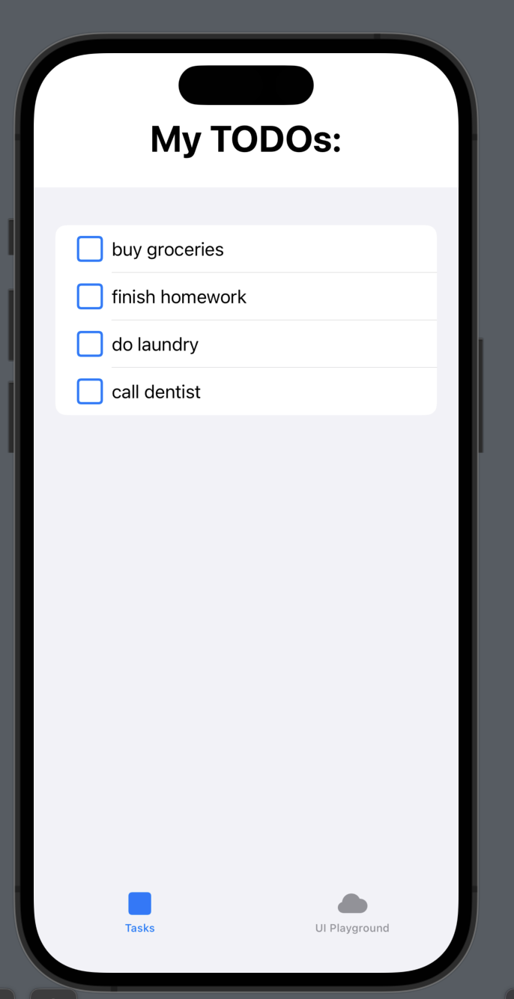

# Swift Freitagsaufgabe 4.5: Wiederholung von TabView, Lists und Komplexen UI Elementen

Endlich Freitag! 📆

Die Woche ist fast überstanden, jetzt heißt es nur noch, zu zeigen, was ihr diese Woche so gelernt habt.

Ziel der heutigen Tagesaufgabe ist eine TaskManager-App zu kreieren, die im "unfinished" Tab eine Liste an abhakbaren ☑ Tasks mit einem Button zum neuen Tasks erstellen anzeigt.
Im "finished" Tab sollen abgehakte Tasks erscheinen.
Die App soll am Ende ungefähr so aussehen:

Los geht's!

# 1. Task Model erstellen

Überleg dir, wie ein Task Model aussehen muss und erstelle dafür eine Swift-Datei. Sie braucht einen Namen und einen Status, der zeigen soll, ob die Task finished/unfinished ist.

# 2. TaskRow erstellen

Erstelle eine SwiftUI-Datei TaskRow, die eine Zeile in der Task-Liste modellieren soll. Das Design steht dir dabei frei. Denk daran, dass jeder Task ein ☑️ haben soll. 
❓ Wie könnte man ☑️ und die Funktionalität, dass die Box bei klick abgehakt/nicht abgehakt wird am besten implementieren?

# 3. TaskScreen erstellen

Erstelle eine SwiftUI-View TaskScreen.
❓ Hier brauchen wir zum Tasks anzeigen welche Art von Variable von welchem Datentyp, die später von der ContentView in den TaskScreen durchgereicht wird?

Das Design steht dir frei, wir brauchen einen Seitentitel (wie "Meine TODOs") und die Liste an Tasks.
Denk dran: es sollen hier nur Tasks angezeigt werden, die nicht abgehakt wurden. Einen ähnlichen Filter haben einige von euch in der RezepteApp benutzt.

# 5. TabView in der ContentView anlegen

In der ContentView legst du als Variable (❓mit welcher @Notation?) manuell eine Liste an tasks an, die wir verwenden werden, um die Tasks in der Liste anzuzeigen (normalerweise würden wir die Liste aus dem ViewModel laden, aber das kommt erst später).

Erstelle jetzt eine TabView, die den TaskScreen als Tab enthält.
Such dir passende Labels und Icons für das Tabitem aus.

Jetzt sollte die TaskView mit abhakbaren Tasks funktionieren.

# 6. Wiederholung UI Elemente

Erinnere dich an die bisherigen UI-Elemente, die wir in den letzten Wochen hatten.
Erstelle eine View ComplexUIView, die du auch der ContentView als Tab hinzufügst und tob dich darin mit den folgenden Elementen aus, um einen Steckbrief für eine Person zu erstellen:
(der Steckbrief ist nur ein Beispiel, falls dir was anderes einfällt, mach gerne das)
- TextField (für Name, Alter, etc.)
- Slider (für die Größe/das Gewicht)
- Picker (für zB eine Augenfarbe, ColorPicker auch möglich)
- DatePicker (für Geburtsdatum)
- Sheet, das mit den angegebenen Daten auftaucht
- Alert, der mit den angegebenen Daten auftaucht

# 7. Closures und Funktionen

**Wichtig: Nutze für diese Aufgabe die enthaltene "7_Closures_and_Functions" playground page im Projekt**

Schreibe eine Funktion namens `generateRandomNumbersArrayWithTwentyRandomNumbers`, die ein Closure-Parameter annimmt und einen Array von zufälligen Zahlen zwischen 1 und 500 zurückgibt. Das Array, welches zurückgegeben wird, soll am Ende **mindestens 20 zufällige Zahlen** enthalten und jede Zahl darf **nur ein mal** in dem Array vorkommen. Das Closure-Parameter soll **eine Zahl als Eingabe** akzeptieren und ein **Bool** als Ausgabe zurückgeben. Die Funktion soll nur die Zahlen in den Array aufnehmen, für die die Closure `true` zurückgibt.

Deine Aufgabe ist es, eine Closure zu schreiben, die der Funktion `generateRandomNumbersArrayWithTwentyRandomNumbers` übergeben werden kann. Die Closure soll eine **Zahl als Eingabe** akzeptieren und eine **Bool als Ausgabe** zurückgeben. Die Closure sollte `true` zurückgeben, wenn die Zahl durch 3 und 5 ohne Rest teilbar ist (Stichwort: Modulo), falls nicht, dann soll sie `false` zurückgeben.

Rufe die Funktion `generateRandomNumbersArrayWithTwentyRandomNumbers` und übergebe die geschriebene Closure (Zahl als Eingabe und Bool als Ausgabe) und gebe das Ergebnis mit dem Array von 20 zufälligen Zahlen, die durch 3 und 5 ohne Rest teilbar sind, in der Konsole aus. In einer weiteren Zeile gebe die Anzahl der Zahlen in dem Array aus um zu prüfen, ob du auch wirklich mindestens 20 zufällige Zahle enthalten hast.

# Bonus Herausforderung:
⚠️ Recherchiere, wie man beim Klick auf eine Task auf eine DetailView navigieren könnte und versuch, es zu implementieren.
